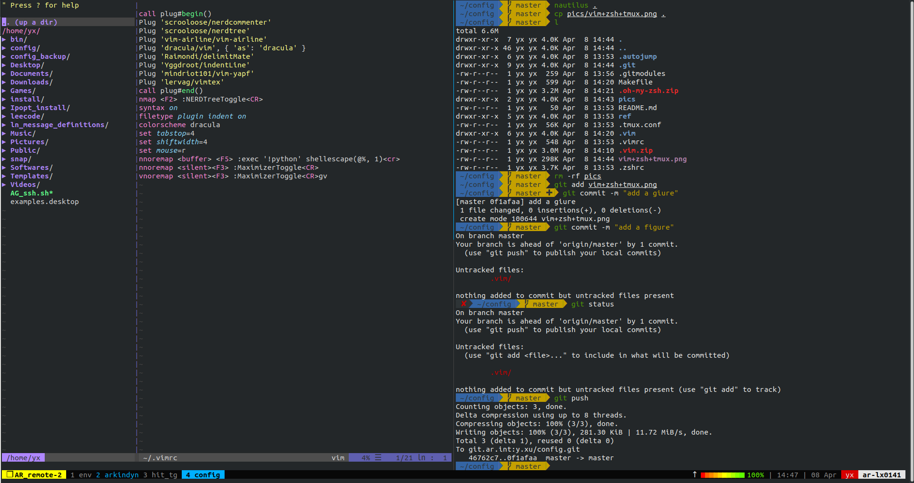

# config

My personal config about vim, zsh, tmux.

# Introduction
The personal repo contains all my configuration, including tmux, zsh, vim. To be clear, I didn't create my persoal configuration, I sorted out some options in the Internet and choose my favourate one. If you my the same favour as mine, you would enjoy this repo.

Since there are too many submodules, I didn't add them one by one, I use a compressed zip file instead. If you want to further add new features, feel free to add new stuff.

The ref directory contains the git project I refer to.

# Use
```
make all
```
to intsall all or
```
make zsh/tmux/vim
```
to install separately.

# One more step
To set the zsh as the default terminal environment. Just dummy add the 'zsh' as last line in ~/.bashrc or ~/.profile, so that you don't need to enter it every time.

# How it looks like?
